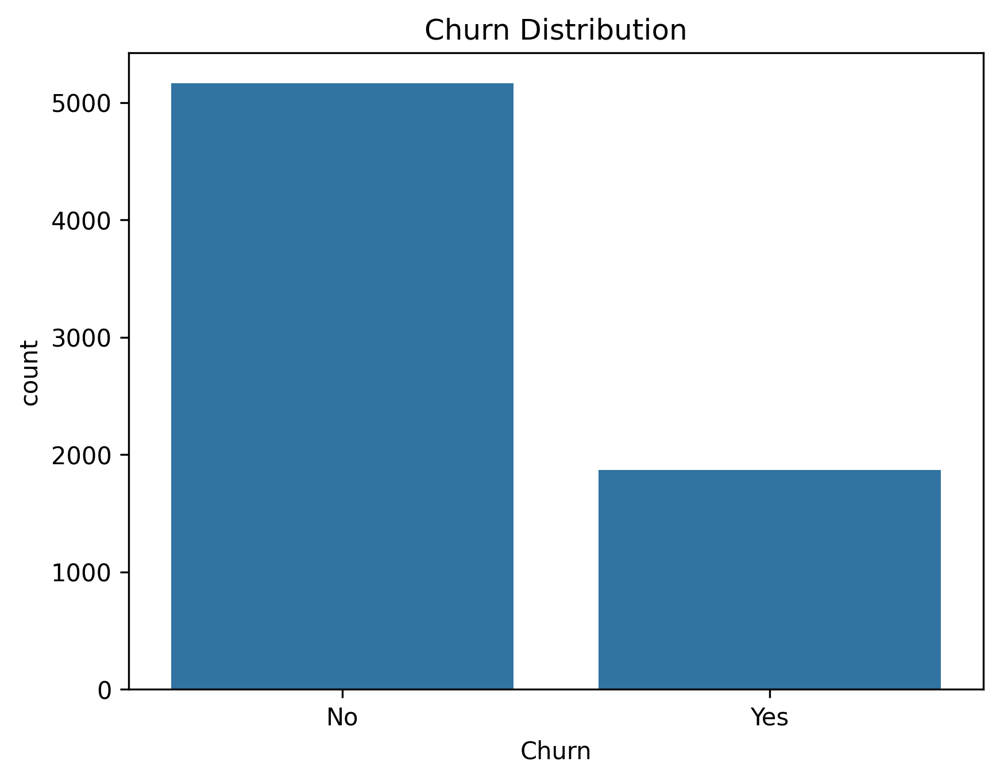

# Telecom Customer Churn Prediction

End-to-end machine learning project focused on predicting customer churn in a telecom company, with a strong emphasis on handling class imbalance and optimizing business-relevant metrics.

---

## Project Overview

Customer churn is a critical problem for subscription-based businesses, as losing customers directly impacts revenue and growth.

In this project, I build classification models to identify customers at risk of churn using demographic, contract, and service usage data.

A key challenge in this dataset is class imbalance, where non-churners significantly outnumber churners. The project focuses not only on prediction, but also on improving the model’s ability to detect actual churners.

---

## Business Problem

Retaining existing customers is typically more cost-effective than acquiring new ones.

Being able to identify customers at high risk of churn allows companies to take proactive actions such as targeted offers, improved support, or contract adjustments.

This project focuses on:

1. Predicting which customers are likely to churn  
2. Maximizing the detection of churners (recall)  
3. Understanding the main factors driving churn behavior  

---

## Dataset Snapshot

Customer churn distribution:



---

## Tech Stack

- Python
- Pandas
- NumPy
- Scikit-learn
- XGBoost
- SHAP
- Matplotlib
- Seaborn
- Jupyter Notebook

---

## Project Structure

```text
telecom-customer-churn-ml/
│
├── data/
│   └── telco_churn.csv
│
├── notebooks/
│   ├── churn_model.ipynb
│   ├── churn_model.html
│   ├── churn_distribution.png
│   └── shap_summary.png
│
├── README.md
└── requirements.txt
```

---

## Workflow

### 1. Exploratory Data Analysis
- Inspect dataset structure and missing values
- Analyze churn distribution (imbalanced dataset)
- Explore customer, contract, and billing variables

### 2. Data Preprocessing
- Encode categorical features
- Prepare target variable
- Stratified train-test split
- Feature scaling for Logistic Regression

### 3. Handling Class Imbalance

To improve detection of churners:

- Logistic Regression and Random Forest use:
  - `class_weight="balanced"`
- XGBoost uses:
  - `scale_pos_weight`

This ensures the model gives more importance to the minority class (churn).

### 4. Model Training

Three classification models were trained and compared:

- Logistic Regression  
- Random Forest  
- XGBoost  

### 5. Model Evaluation

Models were evaluated using:

- Accuracy  
- ROC-AUC  
- Precision (Churn=1)  
- Recall (Churn=1)  
- F1-score (Churn=1)  

Special focus was placed on **recall**, as missing churners is more costly than false positives.

### 6. Threshold Optimization

Default classification threshold (0.5) was adjusted to improve recall.

Lowering the threshold (e.g., 0.4) allows the model to identify more churners, at the cost of lower precision.

This demonstrates the trade-off between:

- Detecting more churners (recall)
- Reducing false positives (precision)

---

## Model Performance

| Model | Accuracy | ROC-AUC | Recall (Churn=1) | F1 (Churn=1) |
|------|--------|--------|------------------|-------------|
| XGBoost | 0.73 | 0.83 | 0.79 | 0.61 |
| Logistic Regression | 0.73 | 0.83 | 0.80 | 0.61 |
| Random Forest | 0.79 | 0.82 | 0.50 | 0.56 |

Note: Accuracy is less informative due to class imbalance, so recall and F1-score are prioritized.

### Key Takeaways

- **XGBoost and Logistic Regression** achieve strong recall after handling class imbalance  
- **Random Forest** remains more conservative, with lower recall  
- The best model depends on business priorities (recall vs precision trade-off)

---

## Key Insights

- Customers with **short tenure** are more likely to churn  
- **Month-to-month contracts** are strongly associated with higher churn risk  
- **Higher monthly charges** increase churn probability  
- **Long-term contracts** reduce churn risk  
- Customers with **fiber optic internet service** are associated with higher churn in this dataset  

From a business perspective:

- Focus on **early-stage customers**
- Encourage **long-term contracts**
- Monitor **high-value customers at risk**

---

## Explainability

Feature importance and SHAP analysis were used to better understand model behavior.

These techniques help answer:

**Why is a customer likely to churn?**


---

## How to Run

### 1. Clone the repository
```bash
git clone https://github.com/juampymv/telecom-customer-churn-ml.git
cd telecom-customer-churn-ml
```

### 2. Install dependencies
```bash
pip install -r requirements.txt
```

### 3. Open the notebook
```bash
jupyter notebook
```

Then open:

```text
notebooks/churn_model.ipynb
```

---

## What This Project Demonstrates

- End-to-end machine learning workflow  
- Handling class imbalance in real-world datasets  
- Model comparison using business-oriented metrics  
- Threshold tuning for decision-making  
- Model interpretability with SHAP  
- Translating ML results into business insights  

---

## Next Steps

- Hyperparameter tuning  
- Cross-validation  
- Cost-sensitive evaluation  
- Model deployment (API or dashboard)  

---

## Author

Juan Pablo Moreno  
Data Scientist