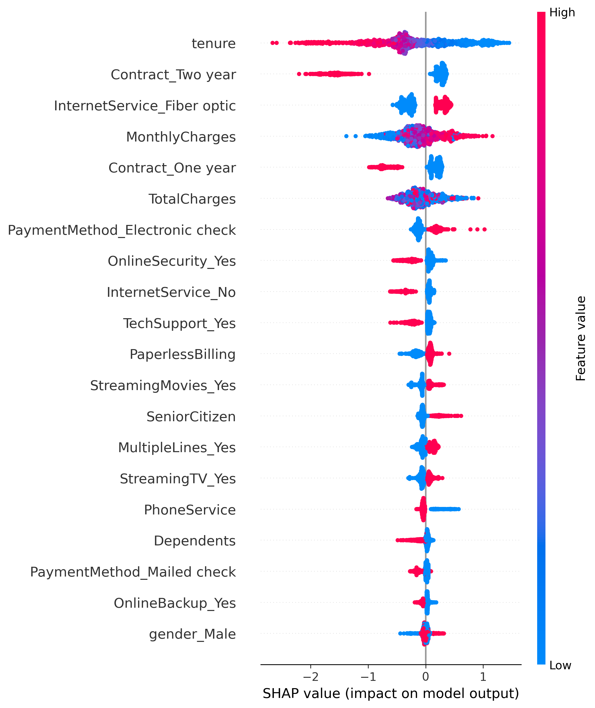

# Telecom Customer Churn Prediction

End-to-end machine learning project focused on predicting customer churn in a telecom company using classification models and model explainability techniques.

---

## Project Overview

Customer churn is a critical problem for subscription-based businesses, as losing customers directly impacts revenue and growth.

In this project, I build a machine learning model to identify customers at risk of churn using demographic, contract, and service usage data.

Beyond prediction, the goal is to understand the key drivers of churn in order to support data-driven retention strategies.

---

## Business Problem

Retaining existing customers is typically more cost-effective than acquiring new ones.

Being able to identify customers at high risk of churn allows companies to take proactive actions such as targeted offers, improved support, or contract adjustments.

This project focuses on:

1. Predicting which customers are likely to churn
2. Understanding the main factors driving churn behavior

---

## Tech Stack

- Python
- Pandas
- NumPy
- Scikit-learn
- XGBoost
- SHAP
- Matplotlib
- Seaborn
- Jupyter Notebook

---

## Project Structure

```text
telecom-customer-churn-ml/
│
├── data/
│   └── telco_churn.csv
│
├── notebooks/
│   ├── churn_model.ipynb
│   ├── churn_model.html
│   └── shap_summary.png
│
├── README.md
└── requirements.txt
```

---

## Workflow

### 1. Exploratory Data Analysis
- Inspect dataset structure and missing values
- Understand churn distribution
- Explore customer, contract, and billing variables

### 2. Data Preprocessing
- Clean and encode categorical features
- Prepare target variable
- Split data into training and test sets
- Scale features when required

### 3. Model Training
Three classification models were trained and compared:

- Logistic Regression
- Random Forest
- XGBoost

### 4. Model Evaluation
Models were evaluated using:

- Accuracy
- Precision
- Recall
- ROC-AUC
- Classification report
- ROC curve comparison

### 5. Model Interpretation

Understanding why a model makes a prediction is as important as the prediction itself.

To analyze the drivers of churn, the project includes:

- Feature importance from tree-based models
- SHAP (SHapley Additive exPlanations) values for detailed interpretation

These techniques help explain which variables increase or decrease the likelihood of churn for each customer.

---

## Model Performance

| Model | Accuracy | ROC-AUC |
|------|------|------|
| XGBoost | 0.80 | 0.83 |
| Logistic Regression | 0.79 | 0.83 |
| Random Forest | 0.78 | 0.82 |

XGBoost achieved the best overall performance, with the highest ROC-AUC and balanced metrics across classes.

---

## Key Insights

- Customers with **short tenure** are more likely to churn
- **Month-to-month contracts** are strongly associated with higher churn risk
- **Higher monthly charges** are associated with increased churn probability
- **Longer contracts** are linked to lower churn risk
- **Fiber optic internet service** is strongly associated with churn in this dataset

From a business perspective, these results suggest that retention strategies should focus on:

- Encouraging customers to move to longer-term contracts
- Monitoring customers with high monthly charges
- Paying special attention to early-stage customers with low tenure

---

## Explainability

Feature importance and SHAP analysis were used to better understand model behavior.

These methods help move beyond prediction alone and answer a more practical business question:

**Why is a customer likely to churn?**

SHAP summary plot showing feature impact on churn prediction:



---

## How to Run

### 1. Clone the repository
```bash
git clone https://github.com/juampymv/telecom-customer-churn-ml.git
cd telecom-customer-churn-ml
```

### 2. Install dependencies
```bash
pip install -r requirements.txt
```

### 3. Open the notebook
```bash
jupyter notebook
```

Then open:

```text
notebooks/churn_model.ipynb
```

---

## What This Project Demonstrates

- End-to-end machine learning workflow
- Model comparison using multiple classifiers
- Use of business-oriented evaluation metrics
- Ability to interpret model predictions with feature importance and SHAP
- Clear connection between predictive modeling and business retention strategy

---

## Next Steps

- Improve recall through threshold optimization
- Perform hyperparameter tuning
- Build a retention-focused business recommendation layer
- Deploy the model as an interactive application

---

## Author

Juan Pablo Moreno  
Data Scientist
